# Thetis on Linux (Linux Mint / Ubuntu / Debian)

This directory holds the native Linux version of Thetis. It is being built
in stages:

| Stage | Component | Status |
|---|---|---|
| 1 | Native libraries: `wdsp`, `ChannelMaster`, `PA19` (PortAudio) | **Done**: builds and passes tests |
| 2 | .NET 8 + Avalonia application, receive | **First milestone**: see [Stage 2](#stage-2-the-avalonia-application) |
| 3 | Transmit: MOX, TUNE, drive, microphone, band filters, transmit safety | **First milestone**: see [Transmit](#transmit) |
| 4 | Setup and calibration: attenuator, level calibration, PA gain, filter edges, antennas | **Done**: see [Setup and calibration](#setup-and-calibration) |
| 5 | WDSP 2.10, and receive noise reduction: AetherSDR's NR2, RN2, NR4, DFNR and WDSP's NNR | **Done**: see [WDSP 2.10](#wdsp-210) and [Noise reduction](#noise-reduction) |
| 6 | Transmit audio processing: VOX, TX equaliser, leveler, compressor, CESSB, CFC, phase rotator | **Done**: see [Transmit audio processing](#transmit-audio-processing) |
| 6a | CAT / TCI control (WSJT-X, fldigi, Hamlib, loggers): serial ports, USB to RS232, virtual ports, TCP, TCI | **Done**: see [CAT and TCI](#cat-and-tci) |
| 7 | PureSignal | **Done**: see [PureSignal](#puresignal) |
| 8 | RX2, sub-receiver, band stacking, more meters | Planned |

Protocol 2 radios (ANAN-G2, 7000D, 8000D and similar) are not planned for
now. The shared code paths exist, but nothing has been tested with them.

## AppImage: run without installing

One file that contains the application, the .NET runtime and the native
libraries:

```sh
chmod +x Thetis-*-x86_64.AppImage
./Thetis-*-x86_64.AppImage
```

It runs on **Linux Mint 22** (Ubuntu 24.04) and **Linux Mint 21** (Ubuntu
22.04), 64-bit x86. Nothing needs to be installed on Mint 22. On Mint 21,
if the JACK client library is missing, the AppImage says so and names the
package: `sudo apt install libjack-jackd2-0`. Settings, FFT wisdom and
caches go to `~/.config/thetis-linux` and `~/.local/share/thetis-linux`, as
with the installed version.

What is inside, and why:

* The self-contained .NET 8 application and Avalonia, with the `wdsp`,
  `ChannelMaster` and `PA19` libraries next to it.
* FFTW (`libfftw3`, `libfftw3f`), which a desktop system usually lacks.
* ALSA and PulseAudio are **not** bundled. They are always present on a
  desktop and have to match its sound configuration.
* The JACK client library has to match the system's JACK or PipeWire-JACK
  server, so the system's copy is used. A bundled copy is used only when the
  system has none (Mint 22 and later).
* If ICU is missing, .NET runs in invariant-culture mode instead of failing.
* DFNR's DeepFilterNet3 runtime and model make up about 20 MB of it.
* Size: about 45 MB. The publish trims only the .NET framework assemblies
  (`TrimMode=partial`), leaving Thetis, `Thetis.Core` and Avalonia whole;
  the settings file uses source-generated JSON, so trimming cannot affect
  it. The native libraries are stripped, and the image is compressed with
  zstd at level 22.

To build it (after `./build.sh --deps`):

```sh
./build.sh --appimage     # -> dist/Thetis-<date>-<commit>-x86_64.AppImage
```

`packaging/build-appimage.sh` uses `appimagetool` from `PATH`, or downloads
it and the AppImage runtime the first time. The native libraries require
at most glibc 2.35 and GLIBCXX_3.4.30 (Mint 21); the `abi` test checks this. glibc 2.38 would otherwise bind `fscanf` to its new C23
variant, so the compat header binds the C99 one; the two differ only in
`%b` input, which is not used.

The AppImage was tested in clean Ubuntu 22.04 and 24.04 root filesystems
that had only desktop libraries (X11, fontconfig, ALSA, PulseAudio, ICU),
with no FFTW, JACK or .NET. On both it connected to the radio simulator,
received, and transmitted with TUNE.

## Quick start (Linux Mint 22)

```sh
cd "Project Files/Source/Linux"
./build.sh --deps        # once: build tools, audio and FFTW libraries, .NET 8 SDK
./build.sh --app         # native libraries + application into dist/thetis
./install.sh             # menu entry "Thetis" and the 'thetis' command
```

The first start optimises the FFTs for your computer (FFTW "wisdom"). This
takes several minutes, and later starts are quick. Then pick your radio and
its model at the top, press **POWER**, and choose the sound device for
receive audio at the bottom. Transmitting is off until you enable it and
choose your region in the **Transmit settings** panel (View menu; see [Transmit](#transmit)).

## Stage 1: native libraries

| Linux library | Windows equivalent | What it does |
|---|---|---|
| `libwdsp.so` (+ `libWDSP.so` alias) | `wdsp.dll` | DSP engine (NR0V), including NR3 (rnnoise) and NR4 (libspecbleach), both linked in statically |
| `libChannelMaster.so` | `ChannelMaster.dll` | Protocol 1/2 networking, audio routing, VAC |
| `libPA19.so` | `PA19.dll` | Thetis' PortAudio fork with the `PA_*` wrappers, using ALSA, PulseAudio/PipeWire and JACK host APIs |
| `libaethernr.so` | (none) | AetherSDR's NR2, RN2, NR4 and DFNR, run in the WDSP receive chain (see [Noise reduction](#noise-reduction)) |

### Build

Tested on Ubuntu 24.04, the base of Linux Mint 22.

```sh
cd "Project Files/Source/Linux"
./build.sh --deps        # first time: installs the build packages with apt
./build.sh               # later builds
./build.sh --native      # optional: -march=native for this CPU
```

The packages it needs are `build-essential cmake pkg-config libfftw3-dev
libasound2-dev libpulse-dev libjack-jackd2-dev`. The libraries land in
`build/`. `ChannelMaster` finds `wdsp` and `PA19` next to itself (`$ORIGIN`
rpath), so keep the three together.

### Tests

`build.sh` runs them automatically. You can also run `ctest` in `build/`.

* **compat**: unit tests for the Win32 compatibility layer (semaphores,
  events, thread handles, waitable timers, thread pool, Interlocked
  semantics, and waits on a closed handle).
* **smoketest**: loads the three libraries with every symbol resolved, then
  runs a wdsp receive channel on its DSP thread. A USB tone must pass and the
  same tone in the opposite sideband must be rejected by more than 60 dB
  (measured: about 139 dB). It also initialises PortAudio and checks the
  fork's `paFloat64` extension.
* **aethernr**: runs NR2, RN2, NR4 and DFNR on synthetic speech in noise.
  Each must reduce the noise between syllables and keep the speech.
* **abi**: fails if a library needs a newer glibc or libstdc++ than Linux
  Mint 21 / Ubuntu 22.04 provide (glibc 2.35, GLIBCXX_3.4.30). Such a
  library would not load there. GCC 13 makes `libaethernr` reference
  `std::string::_M_replace_cold` (GLIBCXX_3.4.31), so
  `AetherNR/src/glibcxx_compat.cpp` defines it inside the library.
* `tools/check_exports.py <Console dir> build`: checks that every entry point
  the C# code P/Invokes into these libraries is exported. All 331 WDSP, 246
  ChannelMaster and 34 PA19 entry points resolve.

### How the port works

The upstream C sources are compiled **unmodified** apart from the three small
changes listed below. This keeps merges from official Thetis easy.

* `compat/include/win32compat.h` and `compat/win32compat.c` implement the
  Win32/Winsock subset the code uses on top of POSIX: critical sections
  (recursive mutexes), semaphores, events, `_beginthread[ex]` handles,
  waitable timers, `QueueUserWorkItem`, MMCSS priority (`SCHED_FIFO`),
  `WSAEventSelect`/`WSAWaitForMultipleEvents` (`poll()`), Interlocked
  operations, `__declspec`, and similar. `compat/include/` also provides
  stand-ins for `<Windows.h>`, `<avrt.h>`, `<ws2tcpip.h>` and the others.
  The header is force-included into every file, as MSVC keywords are always
  available there.
* **Closed handles:** on Windows a `HANDLE` is a table index, and waiting on
  one after `CloseHandle()` fails with `ERROR_INVALID_HANDLE`. Upstream code
  relies on this: `IOThreadStop()` closes the Protocol 1 send thread's
  semaphores without waiting for that thread. Here a `HANDLE` is a pointer,
  so a closed object is marked invalid and its memory is kept for 10 seconds.
  A late wait then fails as it would on Windows instead of corrupting the
  heap. AddressSanitizer found this, as a crash on power-off after
  transmitting.
* **LP64 vs LLP64:** C `long` is 64-bit on Linux but 32-bit on Windows. The
  Interlocked macros convert their operands exactly as Windows does (for
  example, `InterlockedAnd(&x, 0xffffffff)` is an atomic read, not a mask
  that clears the upper half). The exported API was checked: no function the
  C# code calls takes a `long`.
* ASIO is Windows-only. `compat/asio_stub.c` reports "no ASIO driver", so
  ChannelMaster uses its other audio paths, just as it does on a Windows
  machine without ASIO.
* The bundled rnnoise tree is missing its `x86/` headers (they fall under a
  `.gitignore` rule). Empty stand-ins are in `compat/rnnoise/x86/`, because
  those headers only matter to MSVC and runtime CPU dispatch.

Changes to shared sources:

1. `wdsp/eq.h`: the `eq_mults()` prototype gained the missing `double* Q`
   parameter so it matches its definition. MSVC only warns about the mismatch
   (C4029); GCC rejects it. The fix is correct on Windows too.
2. `lib/portaudio-19.7.0/src/hostapi/pulseaudio/pa_linux_pulseaudio.c`: a
   missing PulseAudio/PipeWire server no longer makes `Pa_Initialize()` fail
   for every host API. It is skipped instead, as the JACK backend already
   does. This file is not compiled on Windows.
3. `wdsp/iobuffs.c`, `dexchange()`: fixes a race that also exists on
   Windows. With `bfo` ("block until output available", which ChannelMaster
   uses for every channel), the producer may run one DSP block ahead.
   `dexchange()` released `Sem_OutReady` *before* copying its input block out
   of the two-slot `r1` ring, so a woken producer could overwrite that slot
   first. The DSP then processed the wrong block, which is heard as a click
   followed by about 40 ms of filter ringing. The copy now happens before the
   release. Under CPU load the smoke test failed in 2 of 61 runs before the
   fix and 0 of 90 after it.

### WDSP 2.10

WDSP is Warren Pratt's (NR0V) DSP library. The copy in `Source/wdsp` is
TAPR/OpenHPSDR-wdsp "Release Version 2.10" (commit `b02d5bac`), merged with
Thetis' own additions. It was a three-way merge with TAPR's 1.29 as the
common base:

* 2.10's new modules come in: NNR (neural noise reduction), NURBS-based EQ
  design, WBFM, the phase rotator, and others.
* EQ and CFC use 2.10's code. WDSP 2.00 and 2.10 adopted Thetis' Q-based
  `SetTXAEQProfile`, `SetRXAEQProfile` and `SetTXACFCOMPprofile` signatures,
  so the C# console calls them unchanged. 2.10 designs the parametric EQ
  with a NURBS spline through the band points and accepts Q but no longer
  uses it: in the Windows console, the parametric EQ's Q settings have no
  effect with this WDSP. The 10-band graphic EQ is unaffected.
* Thetis' NR3 (`rnnr`) and NR4 (`sbnr`) stay in the receive chain next to
  NNR and the new `extnr` module.
* Thetis' CBL before/after-AGC position is kept.
* `pscompat.c` keeps six PureSignal entry points that Thetis' PSForm calls
  and 2.10 removed. `psccF` still works. The pin, map, stabilize, ptol and
  ints/spi settings no longer exist in 2.10's calibration, so they are
  accepted and ignored.
* 2.10 changed `GetPSDisp` to return correction curves (11 arguments). Thetis'
  AmpView still passes 7, which would make WDSP write through four stray
  pointers. The 2.10 function is renamed `GetPSDisp2`, and `GetPSDisp` keeps
  the 7-argument form: it returns the collected samples, and zeroes the
  coefficient arrays, which 2.10 no longer computes.
* Bug fixes from AetherSDR's own 2.10 tree
  (`third_party/wdsp/AETHERSDR-PATCHES.md`, patches 1–9):
  * a use-after-free in `SetRXAFMNCde`/`SetTXAFMEmphNC` on every channel
    open
  * leaks in `notchdb` and `nurbs`
  * exit handshakes for the worker and flush threads on `CloseChannel`
  * NULL guards in `nnet`
  * `SetChannelState` restart fixes: a stop quickly followed by a start could
    leave a channel silently dead, which is the transmit/receive keying
    pattern

2.10 plans more FFT sizes and kinds, so its FFTW wisdom file is new
(`wdspWisdom01`). The first start after updating builds it, which takes
several minutes; it took 16 minutes on a slow virtual machine. Later starts
load it.

### Real-time priority

The audio and network threads ask for real-time scheduling, as they use
MMCSS "Pro Audio" on Windows. On Linux this needs an rtprio limit.
Otherwise the threads silently run at normal priority. To allow it:

```sh
sudo usermod -aG audio "$USER"
echo '@audio - rtprio 95
@audio - memlock unlimited' | sudo tee /etc/security/limits.d/audio.conf
# log out and back in
```

## Stage 2: the Avalonia application

The Windows console is a .NET Framework 4.8 WinForms application of about
430,000 lines, drawing with SharpDX (Direct2D). Neither exists on Linux, so
the user interface is being rebuilt on .NET 8 and
[Avalonia](https://avaloniaui.net/). The radio logic underneath is reused
from the Windows sources as far as possible.

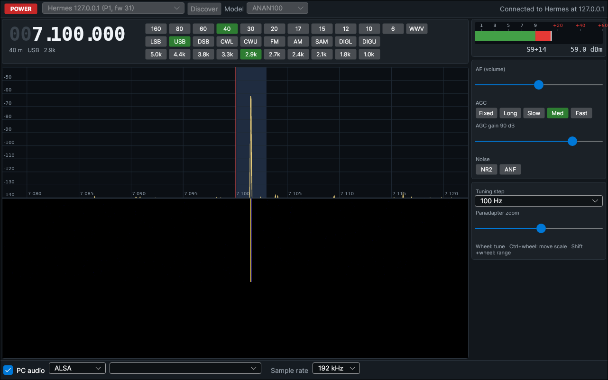

### Layout

| Directory | What it is |
|---|---|
| `Thetis.Core/` | UI-independent radio library (net8.0) |
| `Thetis.Core/Upstream/*.g.cs` | Blocks copied verbatim from the Windows sources by `tools/sync_upstream.py` (the ChannelMaster P/Invoke table, the router tables, the PureSignal imports) |
| `Thetis.Core/Shims/` | Small stand-ins for the parts of the Windows console those files reference (`Display`, `NetworkIO`, `cmaster` start-up, `Win32.memcpy`) |
| `Thetis.Core/Radio/RadioController.cs` | Power on/off, tuning, mode, filter, AGC, volume, NR, sample rate, S-meter, panadapter data, VAC. It follows the call order of the Windows console. |
| `Thetis.Core/Radio/RadioController.Transmit.cs` | MOX, TUNE, drive, microphone, transmit meters, SWR protection, timeout, radio PTT |
| `Thetis.Core/Radio/BandFilters.cs` | Alex HPF/LPF and BPF relay selection, open-collector outputs, the HL2 N2ADR preset |
| `Thetis.Core/Radio/BandPlanRegions.cs` | Band from frequency, and the amateur allocations per region that limit transmitting |
| `Thetis.Desktop/` | The Avalonia application |
| `Tools/Thetis.RadioSim/` | Protocol 1 radio simulator (see below) |
| `Tools/Thetis.CoreCheck/` | Headless end-to-end test of `Thetis.Core` |

These Windows source files (kept in `Source/Console`) are compiled into
`Thetis.Core` **unmodified**: `HPSDR/clsRadioDiscovery.cs`,
`HPSDR/NetworkIOImports.cs`, `HPSDR/specHPSDR.cs`, `HPSDR/Penny.cs`, `dsp.cs`,
`ivac.cs`, `enums.cs` and `clsHardwareSpecific.cs`. The only change to them is in
`clsRadioDiscovery.cs`: two network-interface properties that .NET does not
support on Linux (`IsDhcpEnabled`, `Speed`) are read inside `try`, which
behaves the same on Windows.

`NativeLibraries.cs` maps the Windows names in `[DllImport]` (`wdsp.dll`,
`WDSP.dll`, `ChannelMaster.dll`, `PA19.dll`) to the `.so` files. It looks next
to the application, then in `$THETIS_NATIVE_DIR`, then on the normal library
path.

### What works in this milestone

* Discovery of Protocol 1 and Protocol 2 radios on every network interface
* Power on/off with the model selected (DDC assignment, router tables and
  audio mixer states per model, as `console.cs` does them)
* VFO: wheel over a digit, double-click to type, arrow keys and page up/down,
  wheel or click on the panadapter; tuning steps from 1 Hz to 100 kHz
* Band buttons that remember the last frequency and mode per band
* Modes LSB, USB, DSB, CWL, CWU, FM, AM, SAM, DIGL, DIGU, with the Windows
  filter presets (F1..F10). In CW the receiver sits 600 Hz (the CW pitch)
  from the VFO, as in the Windows console, so a signal on the VFO line is
  heard at 600 Hz. The panadapter is centred on the receiver, and the VFO
  line and filter are drawn on the signal.
* AGC (fixed, long, slow, medium, fast) and AGC gain, volume, NR2, auto-notch
* Sample rates of 48, 96, 192 and 384 kHz
* S-meter, and a panadapter and waterfall with zoom, adjustable dB scale and
  a resizable split
* Receive audio to a PC sound device through VAC (PulseAudio/PipeWire, ALSA
  or JACK), or to the radio's own audio output
* Settings saved in `~/.config/thetis-linux/settings.json`

### Menu bar

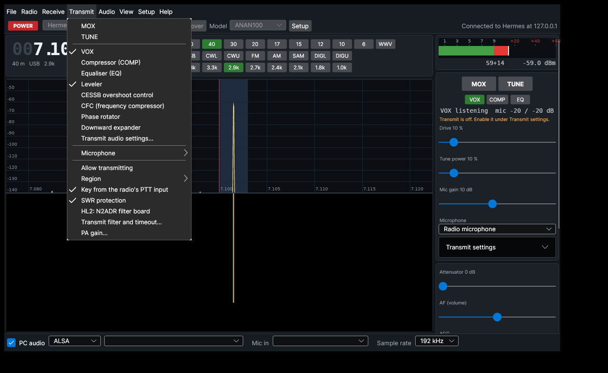

Every option of the main window and the setup pages can be reached from the
menu bar (`Thetis.Desktop/MainWindow.Menu.cs`). The menus are rebuilt each
time they open, so their check marks follow the radio. They drive the same
controls as the panels, so the two always agree.

| Menu | Contents |
|---|---|
| File | Save settings, open the settings or data folder, exit |
| Radio | Power, discover, radio, model, sample rate, receive calibration, antennas |
| Receive | Enter frequency, band, mode, filter, tuning step, AGC, attenuator, noise reduction (and its settings), ANF |
| Transmit | MOX, TUNE, VOX, compressor, EQ, leveler, CESSB, CFC, phase rotator, expander, microphone, allow transmitting, region, radio PTT, SWR protection, HL2 N2ADR board, transmit filter and timeout, PA gain |
| Audio | PC audio, sound system, output device, input device |
| View | Zoom in / out, full span, reset the spectrum scale, transmit settings panel, panels (show, place, fit, reset) |
| Setup | The setup window, or any of its pages directly |
| Help | Keyboard and mouse, receive diagnostics, project page, about |

Shortcuts: Ctrl+S save, Ctrl+D discover, Ctrl+F enter a frequency, Ctrl+,
setup, Ctrl+Q exit, F1 keyboard and mouse help, and Alt with the underlined
letter opens a menu. MOX and TUNE have no shortcut, so a stray key press
cannot key the transmitter.

### Dockable panels

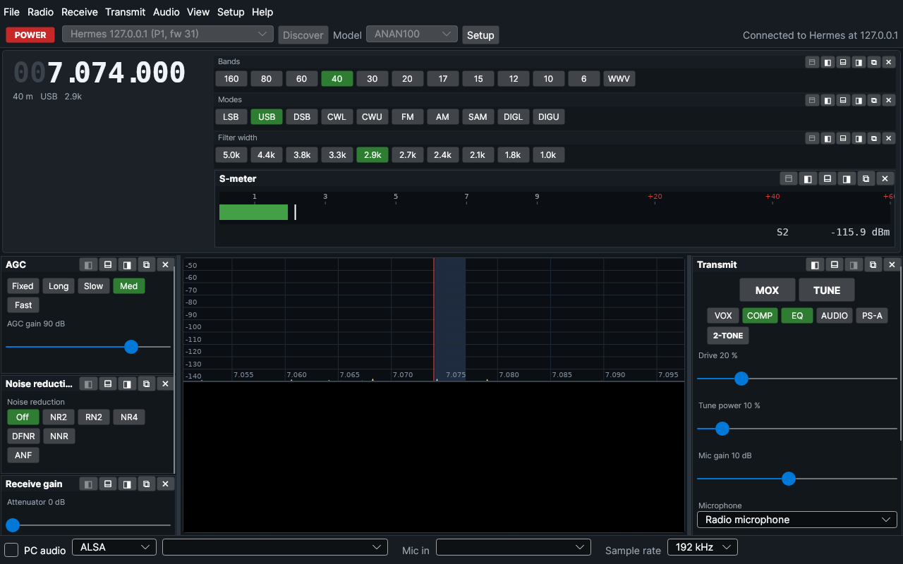

Everything around the panadapter is a separate panel:

| Panel | Contents | Default place |
|---|---|---|
| Bands, Modes, Filter width | The band, mode and filter width buttons | Top, next to the VFO |
| S-meter | The receive meter (S units and dBm) | Right |
| Transmit | MOX, TUNE, VOX, COMP, EQ, AUDIO, PS-A, 2-TONE, the power and SWR readout, drive, tune power, mic gain, microphone | Right |
| Transmit settings | Allow transmitting, region, transmit filter, timeout, radio PTT, SWR protection, band limit beep, HL2 N2ADR board | Hidden (View menu) |
| Receive gain | Attenuator and AF (volume) | Right |
| AGC | The AGC modes and the AGC gain | Right |
| Noise reduction | NR, NR2, NR4, DFNR, NNR, ... and ANF | Right |
| Tuning and display | Tuning step and panadapter zoom | Right |
| [Transmit audio](#transmit-audio-panel) | EQ, leveler, compressor, CFC, VOX, meters | Hidden (AUDIO button) |

Each panel has a title bar with buttons that put it:

* ⬒ at the top, next to the VFO. The button panels and the S-meter can go
  here.
* ◧ on the left or ◨ on the right of the panadapter
* ⬓ below the panadapter
* ⧉ in a window of its own

✕ closes a panel. Dragging a docked panel's title bar takes it out into a
window. Several panels can share a place, and they keep their order.

Every panel can be resized:

* The lines between the panadapter and the left, right and bottom places set
  the width of the left and right columns and the height of the bottom row.
* The grip on a docked panel's edge sets that panel's own size: its bottom
  edge sets its height at the top, left and right, and its right edge sets
  its width at the bottom. The grip lights up under the mouse. When the
  contents do not fit, the panel scrolls; double-clicking the grip (or
  **View → Panels → *panel* → Fit to the contents**) sizes it to its
  contents again.
* A panel in its own window is resized like any window.

A place with only button panels fits them, and the button rows wrap to its
width. **View → Panels** shows, hides and places each panel, and **Reset the
panel layout** puts everything back. Where each panel is, its size and its
window's position and size are saved.

### PC audio (VAC)

Receive audio goes to the PC through ChannelMaster's VAC: one PortAudio
stream for the speakers and the PC microphone together. The **AF** slider
sets its level (VAC takes the receiver audio before the radio's own
volume, so the slider also sets VAC's receive gain). On Linux Mint choose
the **PulseAudio** sound system and your speakers and microphone, or
**ALSA** with the `default` or `pulse` device. Both go through PulseAudio
or PipeWire, which resample as needed.

Two bugs in the bundled PortAudio's PulseAudio support are fixed
(`lib/portaudio-19.7.0/src/hostapi/pulseaudio`, marked "Thetis"):
* **Sample format:** it had no case for the fork's 64-bit float samples and
  sized frames by the application's format. Streams ran 4× (mono
  microphone) to 8× (stereo) too slowly, so most of the audio was dropped
  and speech became noise. It now exchanges 32-bit float with PulseAudio,
  and PortAudio's converter produces the 64-bit samples.
* **Duplex buffer sizes:** a full-duplex stream used the input's frame size
  for the output too, then halved the input for a mono microphone. With a
  mono microphone and stereo speakers that wrote past the output buffer
  and ran 2× too fast. Each direction is now sized by its own frame size.

Tested with PulseAudio null devices: stereo speakers with a mono or a
stereo microphone, through both the PulseAudio and ALSA sound systems
(`thetis-corecheck ... --vac`).

### Receive diagnostics

**Help → Receive diagnostics** (radio on) watches the receiver for five
seconds and reports:
* the radio, firmware and model setting
* the frequencies sent to each DDC
* the sample rate the radio really sends, compared with the setting
* out-of-order packets and ADC overload
* the strongest signal on the panadapter and in the filter
* the S-meter, the receiver's input level and the AGC gain
* the PC audio: the sound system and both devices, the rate the device
  really runs at, PortAudio xruns, and VAC's buffers (underflows,
  overflows, rate ratio)

It flags readings that disagree: a rate the radio did not take, a receiver
that is not running, or a signal in the filter that the S-meter does not
see. The report is saved to `~/.config/thetis-linux/receive-diagnostics.txt`
and can be copied from the window. The bottom bar also warns whenever the
radio's measured rate differs from the setting (Protocol 1).

### Testing without a radio

`Tools/Thetis.RadioSim` emulates a Hermes board over Protocol 1. It answers
discovery, streams I/Q with test carriers at fixed RF frequencies that follow
the host's tuning, and decodes the audio the host sends back to the radio
(its rate, level and dominant tone). It sends I/Q with the spectrum
orientation that the unmodified Thetis receive chain expects from OpenHPSDR
hardware (`--textbook-iq` gives the opposite). It also stops streaming when
the host goes quiet, as the Hermes firmware watchdog does.

For transmit it sends a microphone tone (`--mic-tone`, default 1 kHz at
−20 dBFS). It decodes what the host sends: MOX, the TX frequency, drive, the
Alex filter bits and the open-collector outputs. It analyses the transmitted
I/Q (level and tone) and models a Hermes PA (`--pa-gain`, `--max-power`) and
directional coupler. It reports forward and reflected power into a load of
the chosen SWR (`--swr`). While it runs, writing
`{"swr": 3.0, "ptt": true}` to `<status file>.ctl` changes the load or
presses the radio's PTT input. `--fixed-rate 48000` makes it ignore the
host's sample rate, like a radio that does not take the rate. The receive
diagnostics and the bottom-bar warning are tested with this option.

`Tools/Thetis.CoreCheck` drives `Thetis.Core` against it. It checks
discovery, connecting, DDC tuning and retuning, the audio returned to the
radio (48 kHz, the tone at the expected pitch, and following a retune),
sideband rejection (about 59 dB), the S-meter, the position and height of the
spectrum peak, 48 to 192 kHz rate changes, and a clean power-off. The
transmit checks are listed under [Transmit](#transmit), the setup checks
under [Setup and calibration](#setup-and-calibration), the noise reduction
checks under [Noise reduction](#noise-reduction), and the transmit audio
checks under [Transmit audio processing](#transmit-audio-processing), and
the PureSignal checks under [PureSignal](#puresignal). All 109 checks pass
(`--cat` runs the [CAT and TCI](#cat-and-tci) checks):

```sh
dotnet run --project Tools/Thetis.RadioSim -- --status-file /tmp/sim.json &
THETIS_NATIVE_DIR=$PWD/build dotnet run --project Tools/Thetis.CoreCheck -- ~/.local/share/thetis-linux /tmp/sim.json
```

To use the simulator with the application, start the application with
`THETIS_DISCOVER_LOOPBACK=1` so that discovery also searches the loopback
interface. `thetis-corecheck ... --rx-matrix [MODEL...]` receives with every
Protocol 1 model at 48, 192 and 384 kHz. The S-meter, the spectrum peak and
the demodulated tone must agree with the carrier before and after a retune.
All 96 checks pass (the HPSDR/Atlas model is not meaningful against a
simulated Hermes board). `thetis-corecheck ... --vac <ALSA device> [seconds]` runs PC audio on
a real sound device and checks the rate it runs at and that the receiver
audio does not drop. Tested with PulseAudio's null sink through the ALSA
`default` device. `thetis-corecheck ... --stress-tx 40` powers on, keys TUNE and
powers off 40 times at random intervals.

**Not yet tested:** a real radio, and Protocol 2. The simulator speaks
Protocol 1 only, and this development environment has no radio or sound
card. The Protocol 2 path uses the same ported code (router tables, DDC and
mixer set-up per model), but it has not been exercised.

Found while porting (the Windows build behaves the same way):

* Receiver 2's ChannelMaster input rate has to match the radio rate even when
  RX2 is off. On P1 its audio is always in the output mixer, and the mixer
  waits for every active input, so a stale rate throttled the audio sent to
  the radio to a quarter of what it needs. The Windows console sets it from
  the setup form at start-up. `RadioController` sets it with RX1's.
* `NetworkIO.VFOfreq` truncates instead of rounding, so 7.1005 MHz became
  7,100,499 Hz. The Linux copy rounds.

## Transmit

> **Read this before connecting an antenna.** Transmit has been tested only
> against the simulator, never with a real radio. Start into a dummy load at
> low drive, and check the output frequency, the power and the low-pass
> filter relay on the radio before going on the air. You are responsible
> for what you transmit.

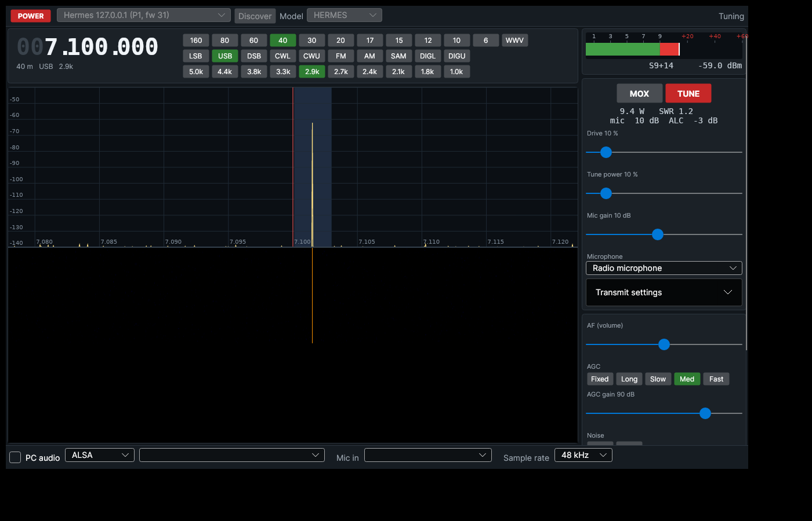

The transmit code follows the Windows console:

* **Keying:** `chkMOX_CheckedChanged2`, `HdwMOXChanged`, `AudioMOXChanged`,
  `cmaster.Mox` and `chkTUN_CheckedChanged`, with the same delays for relays
  to settle (`rf_delay`, `mox_delay`, `ptt_out_delay`).
* **Drive:** `setPowerFromDriveSlider`, with the default PA gain table for the
  model and band from `clsHardwareSpecific.cs`, so *drive %* is roughly
  *watts* on a 100 W radio, as on Windows. The Hermes-Lite 2 uses its own
  formula.
* **Band filters:** `setAlexHPF`, `setAlexLPF` and `setBPF1ForOrionIISaturn`,
  with the Setup form's default band edges. On transmit the LPF follows the
  TX frequency. Open-collector outputs come through the unmodified
  `Penny.cs`. The Hermes-Lite 2 **N2ADR filter board** option loads the same
  OC preset as the Windows Setup form.
* **Microphone:** the radio's mic input, or a PC input device through VAC
  (**Mic in** at the bottom; PC audio must be on). Mic gain is −40 to +70 dB.
  The TX filter defaults to 100 to 3000 Hz.
* **Meters:** forward power, SWR, mic peak and ALC, using the console's
  coupler constants per model (`computeAlexFwdPower`, `computeRefPower`).
* **SWR protection** (console meter loop): an open antenna (over 10 W out
  and almost all of it reflected) unkeys. Above 2:1 the drive folds back to
  `2 / (SWR + 1)`, except while tuning at up to 35 W with the tune power at
  70 % or less. Unlike the console, the fold-back holds until you unkey
  instead of releasing as soon as the reduced power falls under the 5 W
  threshold, which made the console hunt between full and reduced power.
* **Radio PTT input** (mic PTT or footswitch) keys and unkeys the radio.

Safety features added on top of the Windows behaviour:

* CW modes can only TUNE: there is no CW keyer.
* Transmitting is **off** until you tick *Allow transmitting* **and** choose
  your region. The choices are IARU Region 1, 2 or 3, or United States.
* Everything transmitted must fall inside one amateur allocation for that
  region: the VFO plus the whole TX passband, or the ±600 Hz tune carrier.
  So USB at 7.199 MHz with a 3 kHz filter is refused in Region 1. The
  allocations are the common ITU/IARU ones, including the WRC-15 60 m band
  and the five US 60 m channels. They are a safety net, not a statement of
  what your licence allows.
* **Band limits:** once a region is chosen, the panadapter shows the edges
  of its allocations as red dashed lines, labelled with their frequency. When
  a retune takes the VFO from inside a band to outside it, a short beep plays
  on the computer's default sound output. Moving further out, or back in, is
  silent. *Beep when tuning out of a band* in the transmit settings turns
  this off. A request to transmit outside the bands, from MOX, TUNE,
  2-TONE, CAT, TCI or the radio's PTT input, opens a **Transmit not
  allowed** message box. It says whether the frequency is outside the bands
  or the transmit filter would cross the band edge, and gives the band's
  limits. Only one box opens at a time. VOX stays silent, as it would repeat
  on every word.

  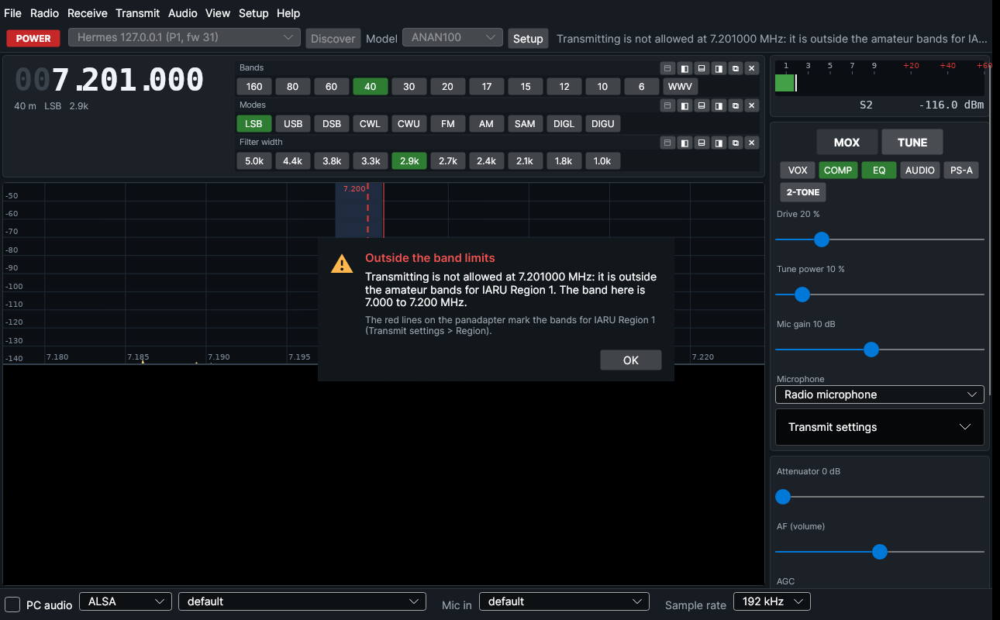
* A **transmit timeout** unkeys after 3 minutes by default (0 turns it off).
* The radio unkeys when:
  * it stops sending data
  * you power off
  * you change mode
  * you retune outside the band being transmitted on
  * the application is terminated (SIGTERM or SIGINT) or crashes with an
    unhandled .NET exception
* The reason for every refusal or forced unkey is shown next to the MOX and
  TUNE buttons.

The transmit checks in `Thetis.CoreCheck` (35 of the 57):

* refusal with transmit disabled, with no region, outside the band, and with
  a passband over a band edge. Only the last two are reported as out of band,
  with the band's limits in the message.
* the band limits per region
* filter bits on 40, 20 and 80 m, on receive and on transmit
* TUNE at 10 %: a carrier at +600 Hz and about 10 W, with forward power and
  SWR meters that agree with the simulator
* retuning while transmitting, within the band and out of it
* SWR fold-back at 3:1 (80 W reduced to about 19 W)
* MOX with the radio mic: the 1 kHz tone appears at +1 kHz in USB and −1 kHz
  in LSB
* the open-antenna unkey, the timeout, radio PTT press and release, and power
  off while transmitting

The simulator decodes transmit I/Q with the same mirrored orientation it
uses for receive. That is the convention the unmodified Thetis chain uses
with OpenHPSDR hardware.

## Setup and calibration

**Setup** (top bar) opens a window with four tabs. Changes apply to the radio
immediately and are saved. Values that depend on the radio model (level
calibration, PA gain) are kept separately for each model.

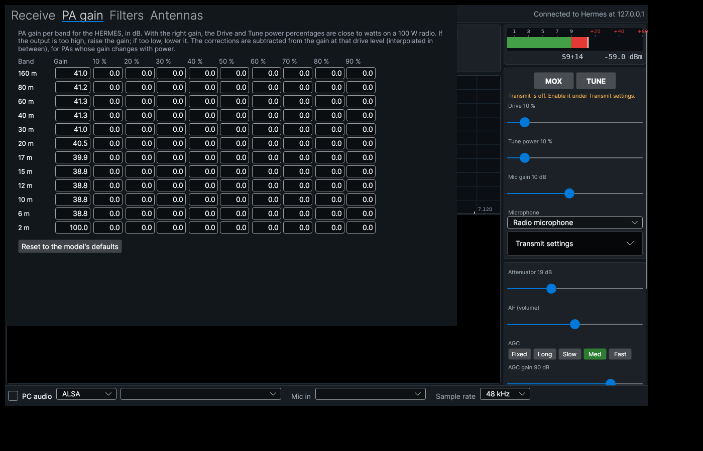

* **Attenuator** (main window, remembered per band). This is the
  `RX1AttenuatorData` step attenuator. The range depends on the model:
  * 0–31 dB on most models.
  * 0–61 dB on Alex-equipped models such as the Hermes and ANAN-10/100/200,
    using the 30 dB Alex pad plus the step attenuator above 31 dB.
  * −28 to +32 dB on the Hermes-Lite 2, where negative values are LNA gain.
    Its data is sent as `31 − dB`. Before this was ported, an HL2 was left at
    31 dB of attenuation.

  The S-meter and panadapter add the attenuation back, as the console's
  `RXPreampOffset` does, so readings stay in dBm at the antenna.
* **Receive:** S-meter and panadapter offsets (the model's defaults until
  changed), plus *Calibrate to a known signal*: feed in a carrier of known
  level near the VFO and both readings are set to it. This is the console's
  level calibration, with one difference. The console averages
  `AVG_SIGNAL_STRENGTH` although its S-meter shows `SIGNAL_STRENGTH`; here
  calibration uses the reading that is displayed, so the S-meter shows the
  reference level afterwards.
* **PA gain:** the console's PA profile. Each band has a gain in dB and nine
  drive-level corrections (10–90 %, interpolated in between), which feed
  `setPowerFromDriveSlider`. Defaults come from `clsHardwareSpecific` for the
  model.
* **Filters:** the Alex LPF and HPF band edges, and the BPF1 edges of
  OrionMKII and Saturn boards (the Setup form's defaults). The filter set
  and relay bits are fixed; only the frequency ranges can be edited. The
  LPF is matched in the console's order, which matters only if edited
  ranges overlap.
* **Antennas:** Alex receive and transmit antennas (ANT1–3) and receive-only
  inputs (RX1 In, RX2 In) per band, and the RX-bypass/Ext inputs while
  transmitting. This follows `Alex.UpdateAlexAntSelection` and
  `AntBandFromFreq`, without transverters or the external Aries ATU. The
  Hermes-Lite 2's I/O board aerial switching is not supported yet.

Also fixed: on the Hermes-Lite 2, low **tune power** now lowers the tune
tone as the console does (its output attenuator has only 16 steps).

The simulator decodes the step and Alex attenuators, and applies them to
the signal it sends. It also decodes the antenna relays. `Thetis.CoreCheck`
covers this area with 17 checks:

* the attenuator ranges and data for the Hermes, HL2 and 7000D
* S-meter and panadapter compensation with 20 dB of attenuation
* 40 dB split into the 30 dB pad plus 10 dB step
* calibration to −50 dBm, after which both read −50.0 dBm
* antennas per band, on receive and transmit
* 3 dB less PA gain, and a +3 dB drive correction, each doubling the output
* edited LPF edges selecting a different filter, then the defaults restored

## Noise reduction

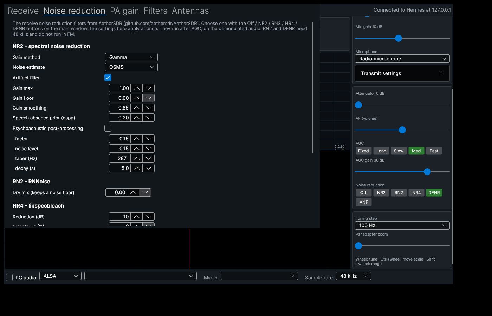

The receiver offers the four noise reduction filters of
[AetherSDR](https://github.com/aethersdr/AetherSDR) and WDSP 2.10's own
neural noise reduction, NNR. You choose one with the
**Off / NR2 / RN2 / NR4 / DFNR / NNR** buttons on the main window, or from
**Receive → Noise reduction**. Their settings are in **Setup → Noise reduction**.
Only one filter runs at a time.

| | What it is | Character |
|---|---|---|
| **NR2** | AetherSDR's spectral noise reduction, an extended port of WDSP's EMNR with gain limits, smoothing and psychoacoustic post-processing | classic; about 20 dB less noise at +7 dB SNR, speech within about 4 dB |
| **RN2** | RNNoise neural noise reduction, with a dry-mix control that keeps some noise floor | strong on speech, even at negative SNR |
| **NR4** | libspecbleach spectral noise reduction | gentle: 10 dB by default, and it levels off around 7 dB on steady noise |
| **DFNR** | DeepFilterNet3 neural noise reduction | the strongest on speech |
| **NNR** | WDSP 2.10's neural noise reduction (`wdsp/nnr.c`), with two built-in models: standard and large | about 14 dB less noise on steady noise by default; audio up to 8 kHz |

How it fits together:

* `libaethernr.so` (`Source/AetherNR`) holds the filters, with Qt removed and
  a C interface. The README there lists the sources and the changes made.
* WDSP's new `extnr` module runs the selected filter in the receive chain,
  after AGC, on the demodulated audio: the same place as Thetis' NR3/NR4.
  Thetis.Core loads the library and hands its functions to WDSP
  (`SetExtNRFunctions`), so WDSP does not link against it.
* NNR is part of libwdsp, so it is always available. It runs on the audio
  resampled to 16 kHz, after AGC by default (Setup can move it before AGC).
  Its models are compiled into libwdsp; a file `wdsp_nnr_0.bin` or
  `wdsp_nnr_1.bin` in the working directory replaces a built-in model.
  Setup has the model, the mask floor (the most it removes, -25 dB by
  default), the maximum gain, the strength (alpha) and its knee, the
  noise-tracking time and the gain smoothing. WDSP's defaults are used.
* Upstream `SetRXANNRRun` did not switch on the band-pass stage after the
  noise reductions, or its make-up gain, as the other filters do. That is
  fixed in `nnr.c` and `RXAbp1Set`.
* RN2 and DFNR need 48 kHz. They do not run in FM, where the receiver runs at
  192 kHz, and the main window says so.
* All five filters treat a steady carrier as noise. A
  CW or data signal can be lowered with them on.
* DFNR's DeepFilterNet3 library (a Rust build) and model are downloaded by
  CMake from AetherSDR's repository at a pinned commit and checked against
  SHA-256 hashes. Without network access the build continues without DFNR
  (`-DTHETIS_DFNR=OFF` skips it).

Licence: AetherSDR is GPL v3, so a build that includes `libaethernr` is
distributed under GPL v3 as a whole. Thetis is GPL v2 or later, which allows
this. DeepFilterNet is MIT or Apache-2.0.

Tests:

* the native `aethernr` test on synthetic speech: noise reduced by 20 dB
  (NR2), 50 dB (RN2), 6 dB (NR4) and 35 dB (DFNR), with speech kept within
  4.4, 0.7, 0.6 and 0.9 dB
* 8 new CoreCheck checks: each filter running in the WDSP chain against the
  simulator, RN2 not running in FM while NR2 does, and switching off again
* 6 CoreCheck checks for NNR: about 14 dB less noise with either model, NNR replacing NR2, the mask floor taking effect,
  NNR running in FM, and switching off again

## Transmit audio processing

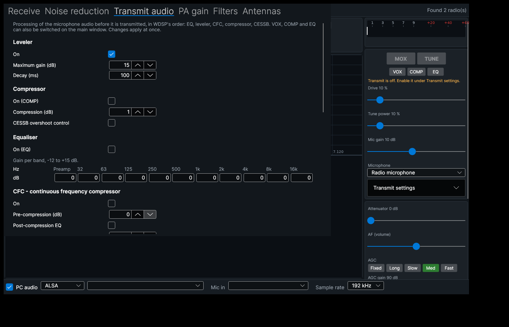

The microphone audio passes through WDSP's transmit chain as in the Windows
console. The settings are in **Setup → Transmit audio**; **VOX**, **COMP**
and **EQ** can also be switched on the main window, below MOX and TUNE.
Defaults are the Windows console's, and the settings are sent with the same
WDSP and ChannelMaster calls (`Thetis.Core/Radio/TxProcessing.cs`).

| | What it does | Default |
|---|---|---|
| Equaliser | 10-band graphic EQ, 32 Hz to 16 kHz, plus preamp, -12 to +15 dB (`SetTXAGrphEQ10`) | off |
| Leveler | slow automatic gain | on, 15 dB maximum, 100 ms decay |
| CFC | continuous frequency compressor: compression per frequency, pre-compression, and an optional post-compression EQ | off |
| Compressor | the speech compressor, 0 to 20 dB | off, 1 dB |
| CESSB | controlled-envelope SSB overshoot control | off |
| Phase rotator | all-pass stages that make the speech waveform more symmetrical | off, 338 Hz, 8 stages |
| VOX | ChannelMaster's downward expander detector keys the transmitter above the threshold and releases it after the hold time, in voice and digital modes | off, -20 dB, 500 ms hold |
| Expander | lowers the background noise between words | off |

VOX goes through the same checks as MOX: it does not key while transmitting
is disabled, outside the bands of your region, or while the radio sends no
data. After a safety stop (timeout, no data, open antenna) VOX does not key
again until you stop speaking. While VOX is on, the main window shows the
level it hears against the threshold.

The simulator takes a microphone level (`"mic_dbfs"` in its `.ctl` file), so
CoreCheck tests this against the transmitted I/Q:

* the EQ with -12 dB at 1 kHz lowers a 1 kHz tone by 12 dB
* the compressor at 10 dB raises a quiet tone by 10 dB
* CFC with 10 dB pre-compression raises the level, and the tone stays at 1 kHz
* the phase rotator keeps the tone and its level
* VOX: silent microphone stays in receive, speech keys (source VOX), silence
  unkeys after the hold time, and VOX does not key while transmit is disabled

### Transmit audio panel

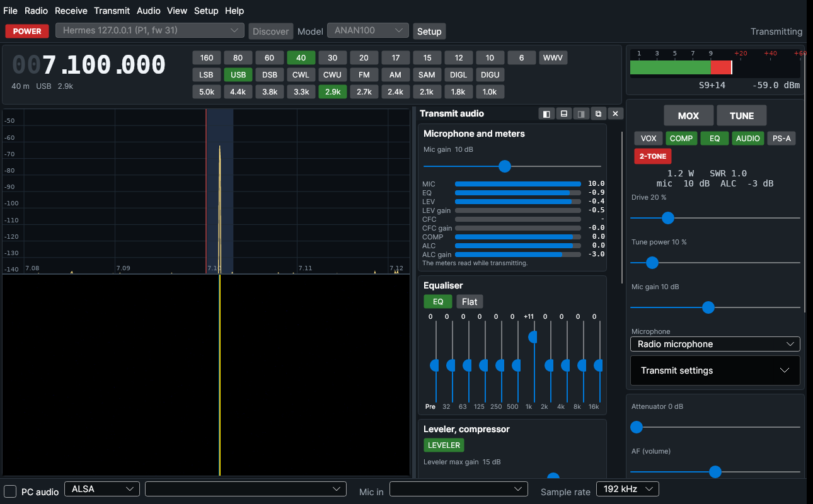

The **AUDIO** button next to EQ (or **View → Panels → Transmit audio**, or
Ctrl+Shift+A) opens a panel with the controls used while operating:

* mic gain, and the transmit chain's meters: MIC, EQ, leveler and its gain,
  CFC and its gain, compressor, ALC and its gain reduction (they read while
  transmitting)
* the 10-band EQ as vertical sliders, with its preamp, an on/off button and
  **Flat**; double-click a slider to set it to 0 dB
* leveler on/off, maximum gain and decay; COMP, CESSB and phase rotator on/off,
  the compression level and the rotator's corner frequency
* CFC and its post-EQ on/off, pre-compression and post-EQ gain (the
  per-band CFC profile stays in Setup)
* VOX and expander on/off, VOX threshold and hold, expander ratio

It is one of the [dockable panels](#dockable-panels): on the left or right of the
panadapter, below it, or in a window of its own. The panel, Setup and the main
window's VOX / COMP / EQ buttons and mic gain slider change the same settings
and follow each other.

## PureSignal

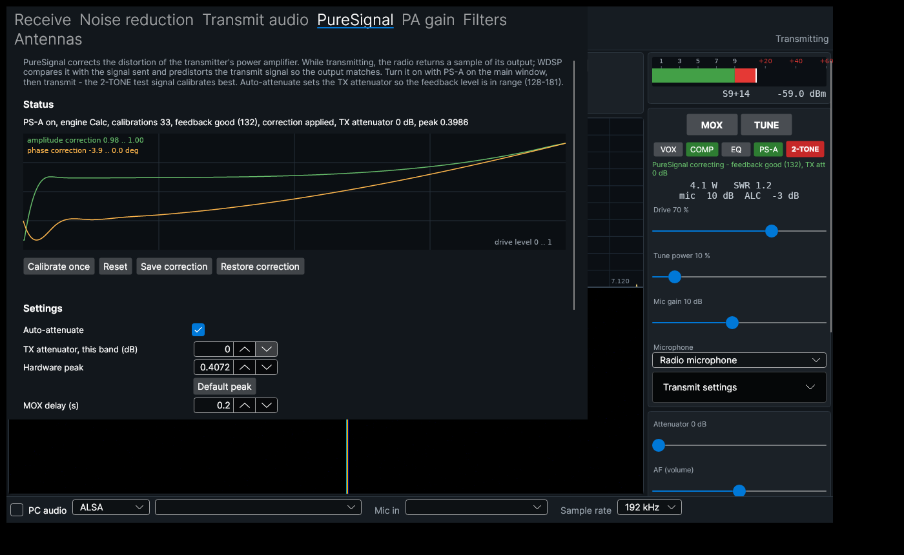

PureSignal corrects the distortion of the transmitter's power amplifier.
While transmitting, the radio returns two extra streams: the signal sent to
the DAC, and a sample of the PA output from the coupler. WDSP's `calcc`
compares them and predistorts the transmit signal so that the output
matches the input.

How to use it:
1. Turn on **PS-A** on the main window (next to VOX, COMP and EQ).
2. Transmit. The **2-TONE** test signal calibrates best.
3. The line under the buttons shows what PureSignal is doing: calibrating,
   correcting, or keeping a correction. It also shows the feedback level
   (good between 128 and 181) and the TX attenuator.

**Setup → PureSignal** has:
* the settings
* **Calibrate once**, **Reset**, and **Save** / **Restore** of the
  correction (one file per radio model and band, in
  `~/.local/share/thetis-linux/puresignal/`)
* a live plot of the amplitude and phase correction curves

The **Transmit → PureSignal** menu has the same controls.

The port follows the console. The files are
`Thetis.Core/Radio/RadioController.PureSignal.cs` and `DdcSetup.cs`.
* **PSForm without the form:**
  * the command state machine (`timer1code`: auto-calibrate, single
    calibrate, stay on, turn off, restore)
  * auto-attenuate (`timer2code`)
  * `PSEnabled`: the feedback DDCs, `SetPureSignal`, the router control bit
    and `SetPSRunCal`
  * the defaults of `PSForm.designer.cs` and the models' hardware peaks
* **Transmit-state DDC configuration:** `console.UpdateDDCs` with its MOX and
  PureSignal branches. Hermes-class radios switch to 192 kHz while
  transmitting with PureSignal, and the 5-DDC ANAN radios use their PS DDC
  configuration.
* **TX step attenuator** ("ATT on TX"), which auto-attenuate adjusts. It is
  remembered per band. The Hermes-Lite 2 range goes down to −28 dB (gain).
* **Two-tone test signal** (`setup.cs chkTestIMD`): tones and level in Setup.
* **One change from the console:** auto-attenuate reacts to every finished
  calibration attempt. PSForm compares the attempt count with the reading
  taken 10 ms earlier, so it only notices attempts that end in that window.
  In testing, that left the feedback level out of range for 30 seconds.

**Hermes-Lite 2:** PureSignal needs the 192 kHz sample rate. The HL2 keeps
its receive rate while transmitting (MI0BOT), and WDSP's calibration does
not work with a 48 kHz feedback stream. The main window says so when PS-A
is on at another rate.

**Testing:** the simulator models a PA with Rapp AM-AM compression and AM-PM
phase shift. It returns the coupler sample and the DAC signal on DDC2/DDC3,
through the TX attenuator, at the hardware peak the host expects (0.4072, or
0.233 for the HL2). It also measures the PA output's third-order IMD. The
CoreCheck PureSignal checks:

| | Hermes | Hermes-Lite 2 (192 kHz) |
|---|---|---|
| IMD3 without PureSignal (70 % drive) | −21.2 dBc | −18.5 dBc |
| IMD3 with PureSignal | −48.2 dBc | −46.4 dBc |
| TX attenuator set by auto-attenuate (from 31 dB) | 4 dB | −11 dB |

The checks also cover:
* the feedback streams requested, at 192 kHz while transmitting
* the correction saved, removed by Reset, and applied again from the file
* receiving at the normal rate after unkeying

Not tested yet: a real radio. The simulator's PA is a model, and the
feedback path of real hardware (coupler, attenuator, timing) will differ.

## CAT and TCI

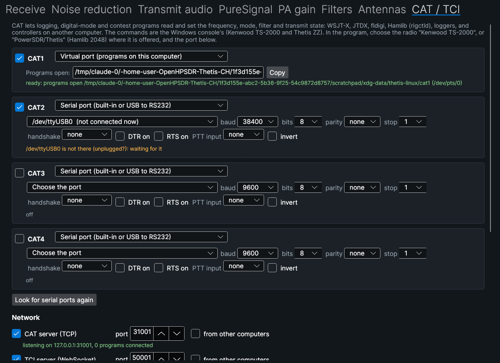

Logging, digital-mode and contest programs (WSJT-X, JTDX, fldigi, Hamlib's
rigctld, loggers) and controllers on other computers can read and set the
frequency, mode, filter and transmit state. The settings are in
**Setup → CAT / TCI**, and changes take effect at once.

**Where programs connect:**

| | What it is | Use it for |
|---|---|---|
| **Serial port** | The computer's own port (`/dev/ttyS0`) or a USB to RS232 adapter (`/dev/ttyUSB0`, `/dev/ttyACM0`: FTDI, Prolific, CH340, CP210x). USB adapters are listed and remembered under their `/dev/serial/by-id` name, which does not change when the adapter goes into another socket. | A program on another computer through a null-modem cable, or a hardware controller. |
| **Virtual port** | A pseudo-terminal that programs on this computer open by name: `~/.local/share/thetis-linux/cat1` (to `cat4`). No cable, com0com or socat is needed. | WSJT-X, fldigi and Hamlib on the same computer: type the name as the radio's serial port (any speed). |
| **CAT server (TCP)** | The same commands over TCP, port 31001 (as the Windows console). | Hamlib's network form (`-r 127.0.0.1:31001`), and controllers on the network. |
| **TCI server** | Expert Electronics' TCI over WebSocket, port 50001 (as the Windows console). | TCI programs (JTDX, MSHV, loggers, SDC). |

There are four CAT ports, each a serial or a virtual port with its own speed
and framing (1200 to 115200 baud, 7 or 8 bits, parity, 1 or 2 stop bits,
RTS/CTS or XON/XOFF handshake). DTR and RTS can be held on for interfaces
that take power from them. Each port's line in Setup says what it is doing,
for example "open", "waiting for it (unplugged?)" or "permission denied".
A USB adapter that is unplugged is reopened when it comes back.

A serial port can also **key the transmitter** from its CTS, DSR or DCD
input (optionally inverted). That input can be a footswitch, or another
program's RTS/DTR PTT through a null-modem cable. The same transmit checks
apply as for MOX (transmit allowed, region, band).

**Permissions:** on Linux Mint, serial ports belong to the `dialout` group.
If Setup says the user may not open them, run
`sudo usermod -aG dialout $USER`, then log out and in again. Virtual ports
and the network servers need nothing.

**In the program:** choose the radio **Kenwood TS-2000** (Hamlib model
2014), or **FlexRadio/ANAN PowerSDR/Thetis** (Hamlib model 2048), which uses
the ZZ commands. Choose the port or the virtual port's name, and PTT method
**CAT**. For WSJT-X with TS-2000, either set its mode to "USB" and turn on
**Report DIGU / DIGL as USB / LSB** in Setup, which makes USB select DIGU.
Or leave that off and set USB or DIGU on the main window.

**Commands:** the Windows console's (its `Console/CAT`): Kenwood TS-2000 and the
Thetis ZZ commands, with the console's formats. The console's own command
table (`CATStructs.xml`) is embedded unchanged, so lengths and errors match:
`?;` for an unknown command or wrong length, and no answer to a set. The 88
commands implemented are those for features this version has:

* **Frequency and tuning:** FA, FB, ZZFA, ZZFB, ZZFT, IF, ZZIF, UP, DN, ZZSA,
  ZZSB, ZZSD, ZZSU, ZZST, ZZAC, ZZAD, ZZAU, ZZAE, ZZAF, FR, FT, ZZSP
* **Mode and filter:** MD, ZZMD, ZZML, SH, SL, ZZFL, ZZFH, ZZFI
* **Bands:** BU, BD, ZZBU, ZZBD, ZZBS
* **Receiver:** AG, ZZAG, ZZMA (mute), GT, ZZGT, ZZAR (AGC gain), ZZRX
  (attenuator), NT, ZZNT, NB, ZZNA, ZZNE, ZZNR, ZZNS, SM, ZZSM, ZZRM, ZZXN,
  ZZVA (PC audio)
* **Transmit:** TX, RX, ZZTX, ZZTU, ZZUT (two-tone), PC, ZZPC, ZZTO, MG, ZZMG,
  PR, ZZCP, ZZCT, ZZET, ZZVE, ZZXH, ZZTH, ZZTL, ZZLI (PS-A), ZZUS (PureSignal
  single calibration), ZZXV
* **Radio:** PS, ZZPS (power), ID, ZZID, ZZVN, ZZZM, ZZZV, AI, ZZAI, RT, XT,
  ZZRT, ZZXS

Differences from the Windows console:

* `TX0;`, `TX1;` and `TX2;` also key the transmitter. Hamlib's TS-2000 and
  TS-480 drivers send these for PTT, and the console's table refuses them,
  so Hamlib's TS-2000 PTT does not work with the Windows console.
* NR selection (ZZNE): 0 off, 2 NR2, 3 RN2 (RNNoise, the console's NR3), 4 NR4.
  1 selects NNR, and DFNR or NNR read back as 1. ZZNR switches NNR and ZZNS
  switches NR2.
* Not offered yet (answered `0`, or `?;` when set): RIT, XIT, split and the
  noise blanker. VFO B is remembered and reported but has no receiver yet.
* Auto information (AI1 / ZZAI1) sends `FA...;` and `FB...;` when the VFOs
  change, as the console does. **Report DIGU / DIGL as USB / LSB** is the
  console's "DigU is USB" option. **ID answers as** can be TS-2000, TS-480,
  TS-50S or SDR-1000.

**TCI** is the Windows console's protocol ("Thetis", 2.0, with the same
spellings: modes in capitals, AGC `normal`, volume in dB). A client gets the
state on connecting, ending with `ready;`, and then every change, whoever
made it. It covers VFO, DDS and IF, modulation, `rx_filter_band`, `trx`,
`tune`, `drive` and `tune_drive`, `volume`, `mute` and `rx_mute`, NR, ANF,
AGC mode and gain, `start` and `stop` (power), and the receive and transmit
sensors. TCI audio and I/Q streaming are not offered yet, so use PC audio
for the audio.

**Monitor:** Setup's monitor shows every command in (`<`) and out (`>`) on
each port, for finding out what a program sends.

Tests (`thetis-corecheck <data dir> <status file> --cat`, 80 checks, all
pass):

* The commands against the simulator: the answers' formats (IF 35
  characters, ZZIF 36, S-meters, signed ZZ values), errors, several commands
  in one write, and TX / RX / TX0 keying the simulated radio.
* **Serial port:** a pseudo-terminal pair stands in for a USB to RS232
  adapter and its cable. The CAT port opens its end through `SerialPort`,
  exactly as it opens `/dev/ttyUSB0`.
* **Virtual port:** a program reads and sets the radio, closes the port, and
  another program reopens it.
* **TCP:** auto information sends the frequency after tuning.
* **TCI:** the initial state, setting VFO, mode, filter and volume, a change
  made elsewhere reaching the client, the sensors, and `trx` keying.
* **Hamlib 4.5.5:** the TS-2000 and PowerSDR/Thetis drivers set and read the
  frequency and mode and key PTT, on the virtual port and over TCP.

Also tried in the application: Hamlib and TCI moving the main window's VFO,
band and mode buttons, and `PS1;` turning the radio on.

Not tested: a physical RS232 port or USB adapter (this environment has
none), and the CTS / DSR / DCD PTT input. A pseudo-terminal has no modem
lines.

## Not yet ported

See the stage table at the top for what is planned next. Beyond that list:
EER, transverters, diversity, ADC assignment, the Hermes-Lite 2
I/O board, the MeterManager meters, MIDI, recording, and skins.

Notes for those stages:

* PortAudio's `unsigned long` fields (`PaSampleFormat`, `framesPerBuffer`,
  callback status flags) are 64-bit on Linux. Any C# declaration of PA19
  stream structs or callbacks must use `nuint`/`ulong`. `AudioDevices.cs`
  only reads `PaDeviceInfo`/`PaHostApiInfo`, which contain no `long` fields.
* The upstream C# declaration of `nativeInitMetis` omits the last C
  parameter (`p2hw_uses_differnt_ports`), so the native side reads an
  undefined value on Windows too. `Thetis.Core` declares the full signature.
